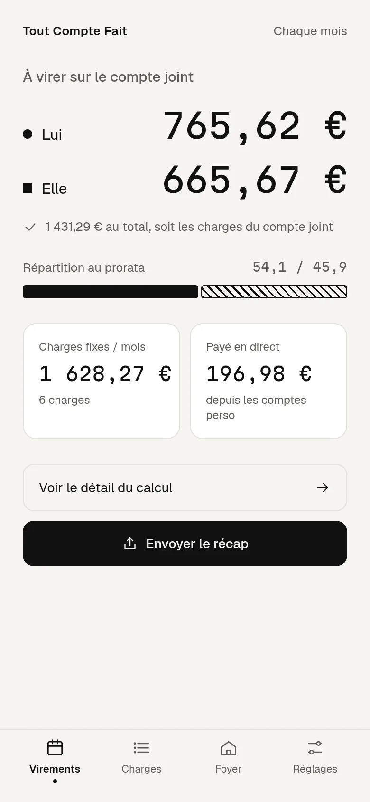
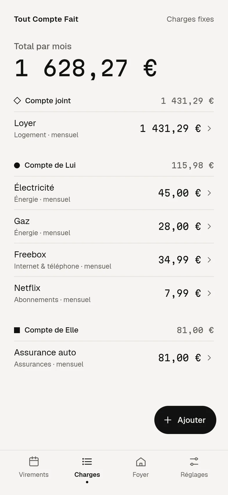
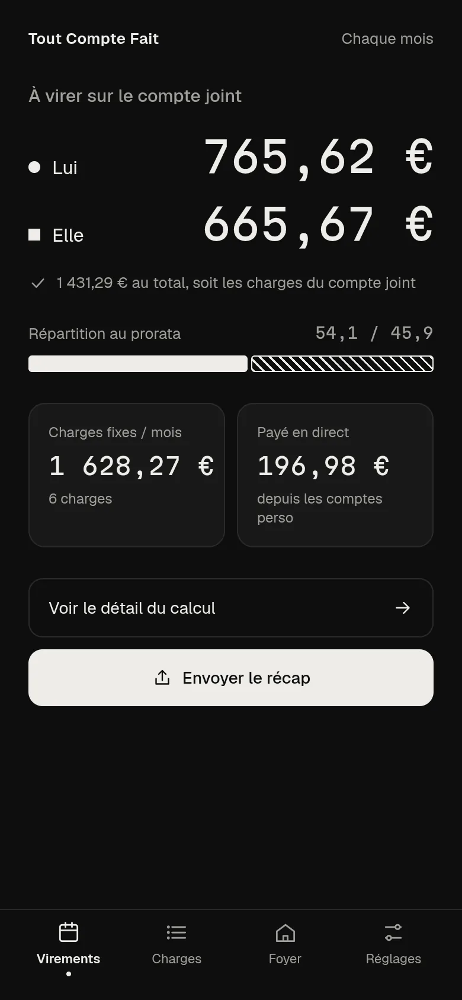
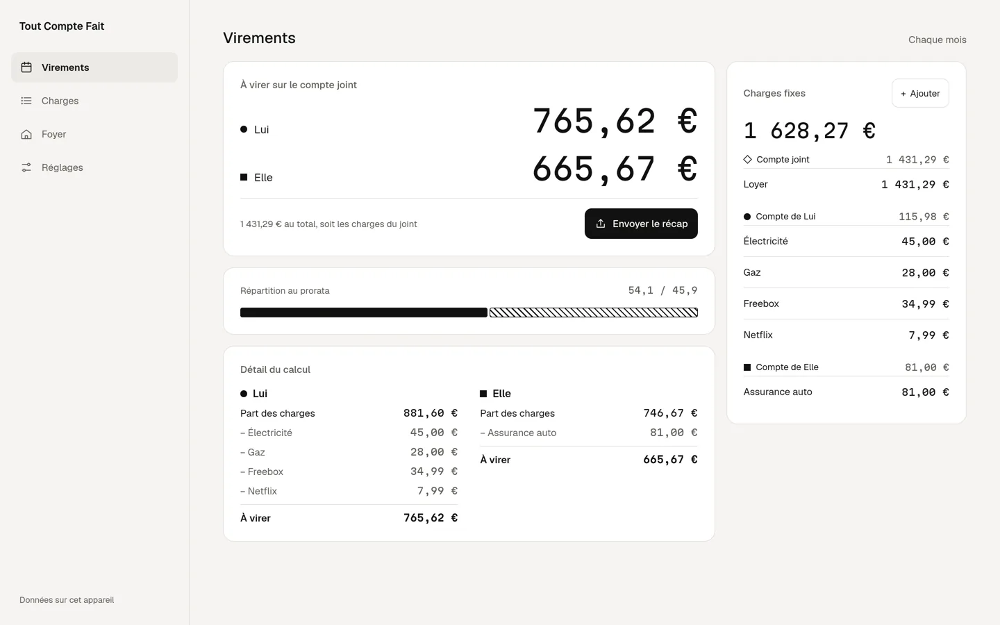

# Tout Compte Fait

**Qui vire combien sur le compte joint.** Tout Compte Fait répartit les charges fixes d'un foyer de deux personnes au prorata de leurs revenus, et dit à chacun le montant exact à virer sur le compte joint.

Gratuit, sans compte, sans serveur, sans pistage. Les données restent sur l'appareil.

→ [toutcomptefait.xyz](https://toutcomptefait.xyz)

<p>
  
  
  
</p>



## Ce que fait l'app

- **Au prorata, pas moitié-moitié.** Chacun participe selon son revenu net ; si un revenu manque ou vaut 0, la répartition passe à 50 / 50 et l'app le dit.
- **Chaque euro justifié.** Le détail montre la part de chacun, ce qu'il paie déjà depuis son compte, et ce qu'il lui reste à virer.
- **Charges mensuelles, trimestrielles ou annuelles**, payées depuis le joint ou depuis le compte de l'un des deux.
- **Remboursement direct** quand l'un paie déjà plus que sa part : il ne vire rien, l'autre vire le joint et le rembourse.
- **Récap à envoyer** par message, export et import d'un simple fichier JSON.
- **Hors ligne et installable** (PWA), en français et en anglais, thèmes clair et sombre, du téléphone à l'ordinateur.

## Le calcul

Tout est calculé en centimes entiers, sans virgule flottante :

1. chaque charge est ramenée à son équivalent mensuel, et leur somme donne le total **T** ;
2. la part de chacun vaut son revenu divisé par la somme des deux ;
3. le dû de chacun vaut `T × part`, arrondi au centime par la méthode du plus fort reste, pour que les deux dûs fassent exactement T ;
4. le virement vaut le dû moins ce que chacun paie déjà depuis son compte.

La somme des virements est toujours égale aux charges payées par le joint. Cet invariant est vérifié par des tests de propriété sur des milliers de foyers aléatoires (`src/domain/split.test.ts`).

## Vie privée

Aucun compte, aucun serveur, aucune mesure d'audience. Les données vivent dans IndexedDB, sur l'appareil ; elles n'en sortent que si vous exportez un fichier, envoyez le récap ou les passez à un autre appareil par code QR (d'écran à caméra, sans réseau).

## Développement

```bash
pnpm install
pnpm dev          # http://localhost:5173 (landing) et /app (l'app)
pnpm test         # Vitest
pnpm lint && pnpm typecheck
pnpm build && pnpm preview   # build de production, servi avec les en-têtes de vercel.json
```

Vite, React et TypeScript strict ; CSS pur ; IndexedDB via `idb` ; codes QR via `qrcode-generator` et `jsqr` ; `vite-plugin-pwa`. Polices Geist et Martian Mono, auto-hébergées.

| Dossier                         | Rôle                                                         |
| ------------------------------- | ------------------------------------------------------------ |
| `src/domain`                    | Calcul pur, sans React ni navigateur                         |
| `src/storage`                   | IndexedDB, export et import validés, synchro QR, préférences |
| `src/i18n`                      | Français, anglais, formatage et lecture des montants         |
| `src/ui`                        | Design system : tokens, composants, icônes                   |
| `src/screens`                   | Écrans de l'app                                              |
| `index.html` · `app/index.html` | Landing (première visite) · app sous `/app`                  |

Le cahier des charges de la v1 est dans [`REFONTE-V1.md`](REFONTE-V1.md), les maquettes dans `design/maquettes/`.

## Licence

[AGPL-3.0](LICENSE). L'ancienne version de l'app est archivée sur la branche `legacy`.
